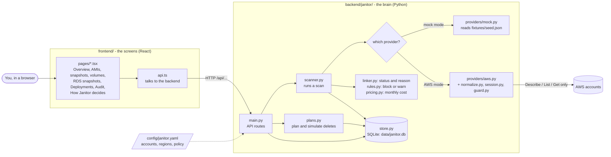
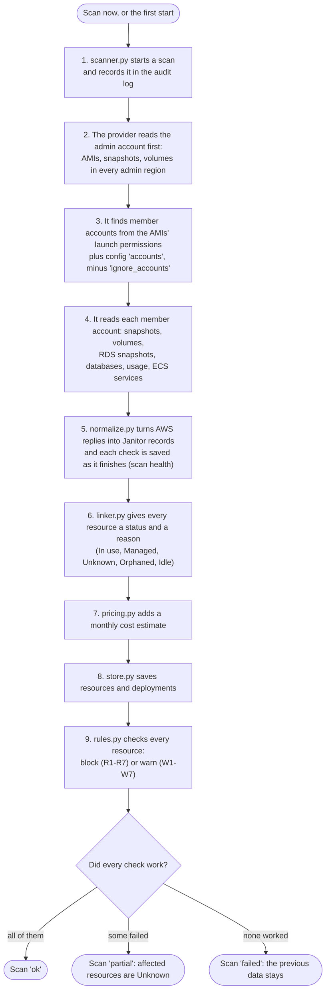
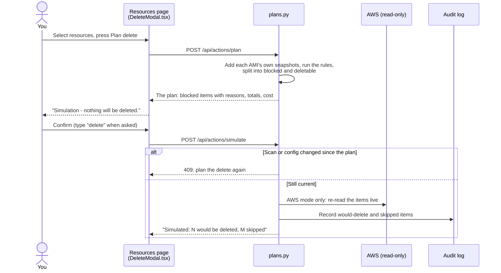

# Janitor guide: how it works and where to change things

For anyone changing Janitor, whether or not you write code every day. Start with the pictures,
then find your change in [Where do I change...?](#where-do-i-change). If something fails, run
`make doctor`, or ask Claude Code to `/troubleshoot`.

## What Janitor does, in one minute

Old AWS disk images (AMIs), disk backups (EBS snapshots), unattached disks (EBS volumes), and
database backups (RDS snapshots) cost money long after anyone needs them. Janitor lists them,
works out whether anything still uses each one, and explains in plain words whether it is safe
to delete. The delete is only a **simulation**: Janitor can't delete, change, or tag anything in
AWS. The Deployments page also shows which app version runs in each environment.

It runs in two modes:

- **Mock mode** (default): made-up data from `fixtures/seed.json`, no AWS needed.
- **AWS mode** (`make run-aws`): reads real accounts, read-only.

## Words you'll see

| Word | Meaning |
|------|---------|
| **Resource** | One AMI, EBS snapshot, EBS volume, or RDS snapshot |
| **Scan** | One full read of every account and region. Each scan is stored; the UI shows the newest. |
| **Check** (or segment) | One part of a scan: one account × one region × one kind of thing. A check can fail alone. |
| **Status** | What Janitor concluded: In use, Managed, Unknown, Orphaned, or Idle |
| **Rule** | A reason to **block** a delete (R1-R7) or **warn** about it (W1-W7) |
| **Admin account** | The AWS account that builds and owns the AMIs and shares them with the others |
| **Member account** | Any other account the AMIs are shared with (dev, uat, prd, ...) |
| **Plan / simulate** | Plan: what a delete *would* do. Simulate: record that in the audit log. Nothing is deleted. |

## The big picture

## What happens during a scan

A scan starts when the app starts with no data, or when someone presses **Scan now**.

In mock mode, steps 2 to 5 are one read of `fixtures/seed.json`. Rules (step 9) also re-run every
time the app starts, so a policy change in `config/janitor.yaml` applies without a new scan.

## What happens when someone plans a delete

## The key parts

| Part | File(s) | What it contributes |
|------|---------|---------------------|
| Screens | `frontend/src/pages/` | One file per page |
| Screen pieces | `frontend/src/components/` | Table, filters, detail drawer, diagram, delete popup, help panel, tour |
| Building blocks | `frontend/src/ui/` | Buttons, cards, dialogs, tabs: the look of everything |
| API client | `frontend/src/api.ts` | Every call to the backend, and the data types the UI uses |
| API | `backend/janitor/main.py` | Every `/api/...` route; starts the app |
| Scan runner | `backend/janitor/scanner.py` | Runs the scan steps in order; turns failed checks into readable messages |
| Status logic | `backend/janitor/linker.py` | Decides In use / Managed / Unknown / Orphaned / Idle and the one-sentence reason |
| Rules | `backend/janitor/rules.py` | R1-R7 (block) and W1-W7 (warn) |
| Help text | `backend/janitor/definitions.py` | What each status means and what to do; the UI shows it from `/api/meta` |
| Delete simulation | `backend/janitor/plans.py` | Builds plans, checks confirmation, writes the audit entry |
| Costs | `backend/janitor/pricing.py` | Monthly estimate with a breakdown, from `fixtures/prices.json` |
| Linkage diagram data | `backend/janitor/graph.py` | What each resource came from and what uses it |
| Storage | `backend/janitor/store.py` | SQLite tables, filters, the audit log |
| Settings | `backend/janitor/config.py` | Reads and checks `config/janitor.yaml` |
| AWS reading | `backend/janitor/providers/aws.py` | Every AWS call (read-only) |
| AWS translation | `backend/janitor/providers/normalize.py` | The only place that knows AWS's field names |
| Safety | `providers/base.py`, `session.py`, `guard.py` | The three read-only locks; see `AGENTS.md` |
| Mock data | `scripts/make_seed.py` -> `fixtures/seed.json` | The made-up dataset for mock mode |

## Where do I change...?

### What people see

| I want to change... | Go to |
|---------------------|-------|
| Text or layout on one page | `frontend/src/pages/<Page>.tsx` |
| What a status means, or what to do about it | `backend/janitor/definitions.py` (not the UI: the UI reads it from the API) |
| A rule's title or explanation | `backend/janitor/rules.py`, `RULES` list |
| The sidebar (add, rename, reorder pages) | `frontend/src/components/Sidebar.tsx`, plus a `<Route>` and title in `frontend/src/App.tsx`. Resource-type pages: `frontend/src/nav.ts` |
| Table columns on a resource page | `frontend/src/components/ResourceTable.tsx` |
| Filters | `frontend/src/components/FilterBar.tsx` and `frontend/src/filters.ts` (filters live in the URL); backend side: `list_filters` in `main.py` and `_where` in `store.py` |
| The detail drawer (tabs, fields) | `frontend/src/components/ResourcePanel.tsx` |
| The linkage diagram | Drawing: `components/LinkageDiagram.tsx`, `graphLayout.ts`. Which links exist: `backend/janitor/graph.py` |
| The delete popup | `frontend/src/components/DeleteModal.tsx`; what it contains: `backend/janitor/plans.py` |
| Overview cards and charts | `frontend/src/pages/Overview.tsx`, `components/StatsHeader.tsx`, `charts/` |
| The Deployments page | `pages/Deployments.tsx`, `deployments.ts`, `components/DeploymentPanel.tsx`; data: `asg_deployments` and `ecs_deployment` in `providers/normalize.py` |
| The help panel | `frontend/src/help.ts`, `components/HelpPanel.tsx` |
| The first-run tour | Steps: `frontend/src/tour.ts`. Each step points at an element with `data-tour="<id>"` |
| The top bar (Scan now, data source badge) | `frontend/src/components/TopBar.tsx` |
| Failed-check messages in scan health | `segment_message` in `backend/janitor/scanner.py` |
| Colors, light and dark theme | `frontend/src/colors.ts`, `theme.ts`, `index.css` |
| CSV export / PDF report | `backend/janitor/export.py` / `frontend/src/export/pdfReport.ts` |
| Cost numbers | `backend/janitor/pricing.py`; refresh rates with `make prices`; breakdown UI: `components/CostBreakdown.tsx` |

### How Janitor decides

| I want to change... | Go to |
|---------------------|-------|
| Thresholds: age in days, protected tags, keep patterns | `config/janitor.yaml` under `policy:` (defaults and checks: `config.py`; documented in `config/janitor.example.yaml`) |
| When something counts as In use, Orphaned, ... | `backend/janitor/linker.py` |
| Add or change a rule | `backend/janitor/rules.py`, then follow [Add a rule](#add-a-rule) |
| When typing "delete" is required | `_needs_typing` in `backend/janitor/plans.py` |

### AWS, data, and setup

| I want to change... | Go to |
|---------------------|-------|
| Which accounts and regions are scanned | `config/janitor.yaml` (`admin`, `member_role`, `accounts`, `ignore_accounts`); the scan order: `providers/base.py` |
| Read a new AWS field | `backend/janitor/providers/normalize.py` |
| Make a new AWS call | `backend/janitor/providers/aws.py`. It must be a Describe, List, or Get call. A new AWS service also needs its Describe permission in `DESCRIBE` in `session.py`; ask for a review first. |
| Add an API route or field | `backend/janitor/main.py`, then the type in `frontend/src/api.ts` |
| Add a database column or table | `backend/janitor/store.py`, and bump `SCHEMA_VERSION` (old scan data is dropped and rescanned) |
| The mock data | `scripts/make_seed.py`, then `make seed`. Don't edit `fixtures/seed.json` by hand. |
| A make command | `Makefile` |
| Tests | Backend: `backend/tests/test_<module>.py`. UI: `<file>.test.ts(x)` next to the file. |

## Recipes

### Add a rule

A rule touches more files than you might expect (adding W7 changed 17). In order:

1. Write the test first: `backend/tests/test_rules.py`.
2. Add the rule to `RULES` and its check to `evaluate()` in `backend/janitor/rules.py`.
3. If it needs new information about a resource, add a field to `Resource` in `models.py`, fill it
   in `linker.py` or `scanner.py`, store it in `store.py` (bump `SCHEMA_VERSION`), and test each step.
4. If it needs a new setting, add it to `Policy` in `config.py` and document it in
   `config/janitor.example.yaml`.
5. Optional: to show it in mock mode, add data that triggers it in `scripts/make_seed.py`, then
   run `make seed`.
6. Update the rules table in `AGENTS.md` and, if users configure it, the README.
7. Run `make test`.

The rule's text appears in the UI automatically through `/api/meta`.

### Add a page

1. Create `frontend/src/pages/<Name>.tsx` (copy the shape of `pages/Audit.tsx`).
2. Add a `<Route>` and a title in `frontend/src/App.tsx`.
3. Add an `<Item>` in `frontend/src/components/Sidebar.tsx`.
4. If it needs data, add a route in `backend/janitor/main.py` and a call in `frontend/src/api.ts`.

## Before you commit

- `make test` runs everything CI would: backend tests, lint, the leak check, type check, UI tests.
- **The repo is public.** Use fake account IDs (`111111111111`-style). Real settings stay in
  `config/janitor.yaml`, which git ignores. The pre-commit hook blocks real-looking IDs; don't
  skip it.
- UI wording: sentence case, buttons start with a verb, errors say what happened and then what to
  do. Never "successfully", "please", or "!". A test enforces this.
- More rules for code changes are in [`AGENTS.md`](../AGENTS.md).

## When something breaks

1. Run `make doctor`. It checks Python, Node, packages, git hooks, your config, AWS profiles, and
   ports, and says how to fix each problem.
2. In Claude Code, type `/troubleshoot` and paste the error. It knows Janitor's error messages
   and their fixes.
3. The terminal running the app shows the full error behind any "The server returned 500" message.
